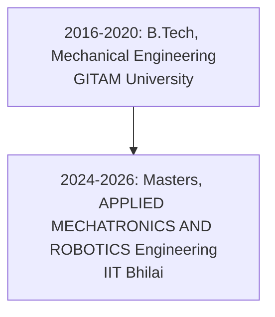

---
hide:
  navigation: true
  toc: true
---
[Resume](Pedakolimi_Harish_Resume.pdf){ .md-button }

# Career Timeline with Job Details
---
## Kelvin6k Technologies Private Limited – Chennai (Apr 2024 – Present)
* Conceptualize, develop, and deploy ROS-based software solutions geared towards orchestrating the movements of our SCARA robotic arm in the realm of 3D construction printing applications.
* Foster collaboration with hardware engineers to seamlessly fuse software functionalities with hardware components, ensuring flawless integration and peak performance of the robotic arm.
* Engineer algorithms and execute motion planning techniques to optimize the trajectory of the robotic arm, aiming for precision and efficiency in 3D printing endeavors.
* Innovate by designing and developing fresh web interfaces and machine language code specific to 3D printing, while also programming user-friendly Human-Machine Interfaces (HMIs) for motion control systems.

# Mentor – Sure Trust – WFH (Present)
* Guide and support undergraduates in understanding and applying robotics concepts through hands-on learning and practical exercises.
* Teach essential robotics principles, fostering a deep understanding of theoretical and practical aspects, including programming, mechanics, and electronics.
* Dedicate time and expertise on a voluntary basis, contributing to the academic and professional growth of students passionate about robotics.

## Jr. Robotics Engineer – AI BAR – WFH (Dec 2021 – Oct 2023)
* Designed, executed, and validated cutting-edge features and algorithms in ROS, ensuring seamless integration into the robotic systems
* Successfully integrated, tested, and debugged software solutions in simulation environments nd on tangible robotic platforms
* Collaborated effectively with cross-functional teams including software developers, hardware engineers, operations personnel, and other stakeholders
* Building protypes for different robots and IoT devices
* Demonstrated leadership skills by mentoring and guiding fellow members of the robotics team in achieving their professional development goals

## Intern – HIND ROBO – Hyderabad (Aug 2021 – Dec 2021)

* Developed engaging and easily comprehensible course content for children.
* Demonstrated creativity and innovation by designing remarkable Arduino projects.
* Assessed and resolved issues by thoroughly testing and debugging various projects.
* Strategically selected suitable components for each project.
* Utilized CAD software proficiently to construct precise 3D printer models.

## Intern – C.E.M.S (Centre of Excellence in Maritime and Shipbuilding) – Visakhapatnam (May 2019 – Jun 2019)
* Acquired an understanding of the programming, software, and maintenance of the KUKA industrial robots.
* worked on three industrial robots designed and built by KUKA.
* Since I was the sole intern, I had exclusive duties and insights regarding the material-handling robot, plasma cutting, and MiG welding robot.
* I was the top pupil at the time.

## Intern – Defence Research and Development Organization (DRDO) – Bhubaneswar (May 2018 – Jun 2018)
* Gained practical knowledge working on cooling systems and components of a radar system.
* Maintained and worked on the communication system of the radar base.
* Researched and explored new areas of engineering within the organization.

# Education Timeline

